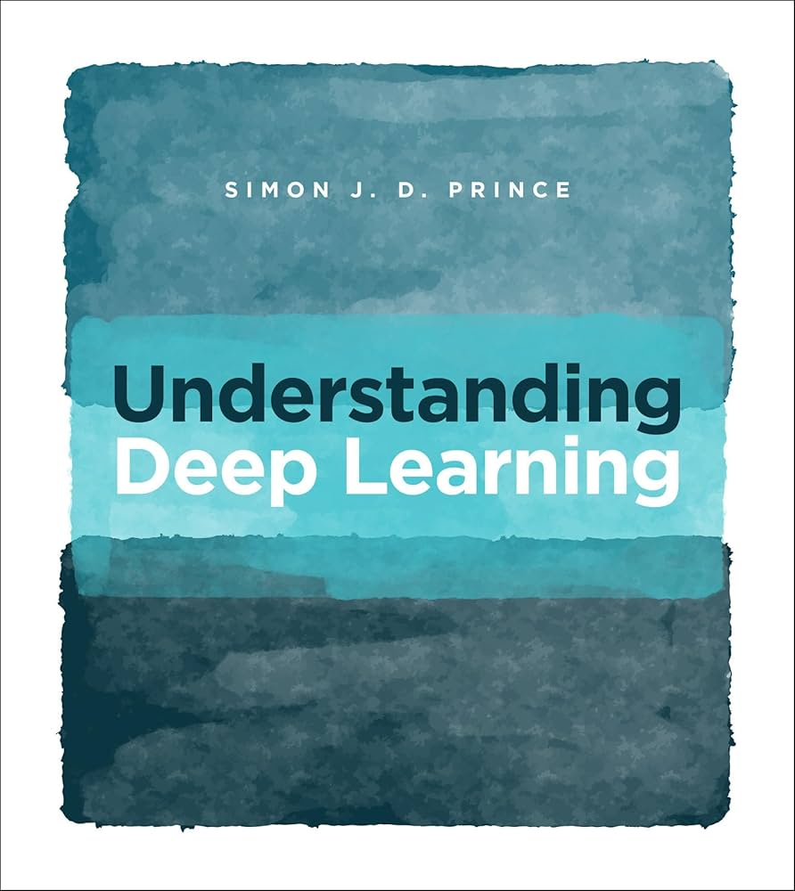

# Understanding Deep Learning ChapterWise Solved Notebooks
## Introduction
This repository contains all the solved notebooks from the textbook Understanding Deep Learning. The original problem notebooks, authored by Mark Gotham, did not have solutions in it. The solutions to those problems are available in the Notebooks folder, categorized by chapter.

The problems begin from Notebook 3.1 in the UDL textbook. Some trivial notebooks, such as Notebook 3.3, have been excluded for brevity.
This collection will be continuously updated with solutions to more problems.

## Structure
Find the problems in the Notebooks folder, organized by chapter.
Each solved notebook follows the original problem structure while providing clear explanations and implementations.

## Table of Contents

| Chapter |Title| Notebooks|
| ---------|----- | ---------------- |
| Chapter 3 |Shallow Neural Networks|3.1, 3.2 ,3.4 |
| Chapter 4 |Composing Networks|4.1, 4.3 |
| Chapter 5 | Loss Functions | 5.1, 5.2,5.3 |
| Chapter 6 | Fitting Models | 6.1,6.2,6.3,6.4,6.5|
